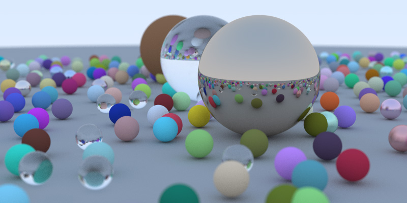

# Ray Tracing in One Weekend with Rust

本项目为一个简单的光线追踪渲染器，参考[《Ray Tracing in One Weekend》的C++代码](https://zhuanlan.zhihu.com/p/128685960)，用Rust实现。仅一个main.rs文件。实现了基本的漫反射、金属、玻璃材质，导出的渲染图如下。

This project is a simple ray tracing renderer, referring to the C++code of [Ray Tracing in One Weekend](https://raytracing.github.io/books/RayTracingInOneWeekend.html), implement using Rust. Only one *main.rs* file. Lambert, metal and glass materials have been implemented, and the exported rendering image is as follows.

## 依赖 Dependency

1. Rayon: 用于多线程加速渲染 Used for multi-threaded accelerated rendering.
2. nalgebra: 提供Vec3支持 Provide Vec3 support.
3. tokio、indicatif: 实现进度条 Used to implement a progress bar.

## 用法 Usage

`cargo run --release` 运行并等待完成。 Run and wait for completion.

然后打开目录下的`pic.ppm`图片文件即可。Then open the `pic.ppm` image file in the directory.

## License

The project is released under MIT License.

